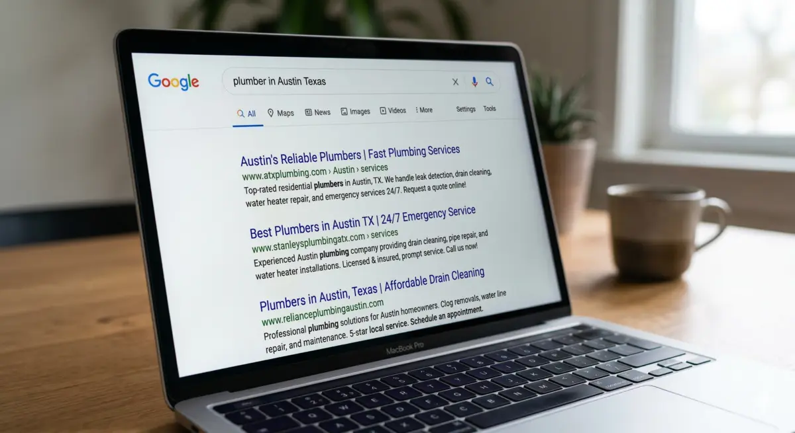
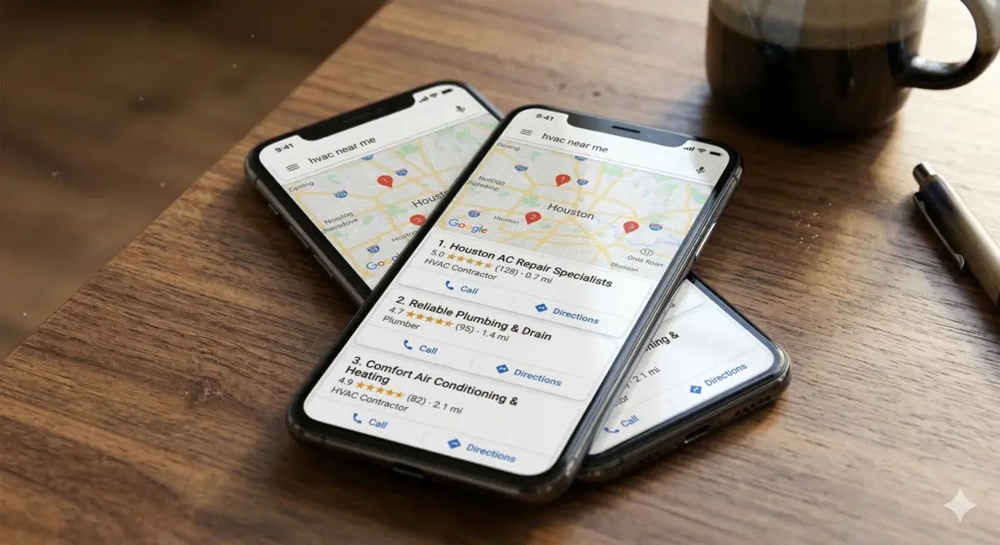

Right now, someone in your city is searching for exactly what your business offers. They typed it into Google. They found your competitor. They called them.

That is not a hypothetical. That is happening every day; businesses are not on page one.

SEO is the reason some businesses get the call and others do not. It is not magic. It is not technical wizardry. It is simply the process of making sure your business shows up when the people who need you go looking.

In this guide, we will break down what SEO actually is, how it works for businesses specifically, and why it matters more than most business owners realize.

**Key Takeaways:**

- SEO is how customers find your business when they search for your service online
- Local businesses deal with two separate algorithms: Google Search and Google Maps
- Not ranking means losing real leads and revenue to competitors every single day
- A well-executed SEO strategy compounds over time and becomes one of your most valuable business assets
- The businesses dominating local search are not bigger. They are just better optimized.

## What Is SEO?

SEO stands for search engine optimization. In plain terms, it is the work you do to make your business findable when potential customers search for your services online.

It is not about gaming Google or stuffing your website with keywords. It is about making your website the most relevant, credible answer to what your customer is searching for.

When SEO is done right, your business shows up at the top of search results without paying for every single click. That is the core value of it.

## How SEO Actually Works for a Business

Here is something most articles will not tell you. Local businesses are not dealing with one search algorithm. They are dealing with two. Most SEOs only optimize for one of them.

### Google Search and the Organic Rankings

Google Search is the traditional organic result. Ranking here comes down to two things: targeted content and authority.

- Targeted content means pages built around exactly what your customers are searching for.
- Authority means other credible websites link to yours, telling Google your site is trustworthy.

The formula is simple: Content + Authority = Rankings. One well-targeted page for one service in one city will consistently outperform a generic page trying to cover everything.

### Google Maps and the Local Pack

Google Maps runs on an entirely separate algorithm from organic search. When someone searches for a local service, they often see a map with three business listings before any organic results. That is the local pack.

Maps rankings are driven by:

- Your Google Business Profile optimization
- The quantity and quality of your reviews
- How close you are to the searcher
- How well your website supports your GBP

Reviews are the single biggest ongoing factor. They function like backlinks do for organic search.

### Why Both Matter

A customer searching for an HVAC company in Denver will see Maps results before they ever scroll to organic. If your business is not showing up in both places, you are only half-visible. The businesses that dominate both own the page.

## Why SEO Is Important for Business

### 1. Your Customers Are Already Searching

Before most people call a business, they search. Before they book, they search. Before they request a quote, they search. The buying journey almost always starts on Google.

The top three organic results capture the majority of all clicks. If your business is not on page one, most searchers will never know you exist. This is not about traffic for the sake of it. It is about whether the right person finds you at the exact moment they are ready to hire someone.

### 2. SEO Is a Business Asset, Not a Monthly Expense

When you run paid ads, you are renting visibility. The moment you stop paying, the traffic stops.

SEO is different. A page that earns a strong ranking keeps generating leads month after month without paying for every click. Paid ads are renting office space. SEO is buying the building. One disappears when the lease ends. The other grows in value the longer you own it.

### 3. Every Day You Are Not Ranking You Are Losing Leads

If a competitor ranks number one for your main service keyword, they are getting the calls that should be going to you. Every month. Every week. Every day.

Think about that in real numbers:

- Competitor ranks number one for your service keyword
- They book 20 to 30 leads per month from organic search alone.
- You get zero from that same channel.
- That gap is not a visibility problem. It is a revenue problem.

SEO does not just grow your business. Ignoring it actively costs you.

### 4. It Builds Trust Before the First Call

People trust Google. When your business ranks at the top, that position borrows credibility from Google itself. Stack strong reviews on top of that and the trust compounds.

A business with 150 five-star reviews sitting in position one on Maps is not just visible. It is the obvious choice. By the time a customer calls you, SEO has already done the selling.

### 5. SEO Reaches Customers at the Exact Moment They Are Ready to Buy

No other marketing channel does this. When someone searches for a service, they are not browsing. They are actively looking for a solution and ready to act.

- Billboards reach people who may never need what you sell.
- Social media reaches people in scroll mode
- SEO reaches people in decision mode

You are not interrupting their day. You are answering their question. That is why organic leads from search consistently convert better than leads from almost any other channel.

### 6. It Supports Everything Else You Are Doing

When a potential customer hears about your business from any channel, the first thing they do is Google you. If your site looks weak or your GBP is incomplete, you lose them right there. The rest of your marketing spend goes to waste.

SEO does not compete with your other marketing. It makes all of it work better.

### 7. Your Competitors Are Already Doing It

In most local markets, the businesses on page one right now did not get there by accident. They invested in SEO. The longer they keep building and you do not, the bigger the gap becomes. If you start now, you start closing it. Every month you wait, the hole gets deeper.

### 8. SEO Works for Every Type of Local Business

If people are searching for what you offer, SEO applies. This includes:

- Home services (HVAC, roofing, plumbing, moving)
- Legal and medical
- Automotive and detailing
- B2B services

Local SEO is the great equalizer. A well-optimized small business can outrank a large national brand in its own backyard because Google prioritizes relevance and proximity over size.

## What Nobody Tells You About SEO

### More Pages Does Not Mean More Traffic. The Right Pages Do.

Most businesses make one of two mistakes. Either they have no SEO at all, or they publish a flood of random content hoping something sticks. Neither works.

The businesses that rank consistently follow one rule: one service, one city, one target keyword per page. This is called silo architecture.

Instead of one page covering all your services in all your cities, you build a dedicated page for each service and each location. Each page is laser-focused on one search query. Google understands exactly what it is about, who it is for, and where it is relevant.

One well-built, targeted page will consistently beat ten generic pages every time.

## Where to Start With SEO for Your Business

### Step 1: Know What Your Customers Are Searching For

Search your core service and your city. See who is ranking. Those are your real organic competitors. What they have built tells you exactly what you need to build to compete.

### Step 2: Build the Right Pages

- Homepage targets your primary keyword
- Each service gets its own dedicated page.
- Each city you serve gets its own page.

This structure is what allows Google to understand your business and match it to specific searches.

### Step 3: Optimize Your Google Business Profile

- Choose the primary category that best matches your core service.
- Fill out every section completely
- Match your name, address, and phone number exactly to what is on your site.
- Get reviews consistently. They are the number one Maps ranking factor and the first thing customers check before calling.

### Step 4: Build Authority Over Time

Authority comes from other credible websites linking to yours. Local citations, directories, and partnerships all contribute. This takes time, but it is what separates page one from page three. The longer you build, the stronger your position becomes. SEO compounds.

## The Bottom Line on Why SEO Matters for Your Business

Go back to where we started. Someone just searched for your service. They found your competitor. They called them instead of you.

SEO is how you change that. It is how you show up first, build trust before the first call, and generate leads without paying for every click.

It is not optional for businesses that want to grow. It is the foundation everything else sits on.

Ready to stop losing leads to competitors? Start with a free SEO audit of your website and Google Business Profile to find out exactly what is holding you back.

## Frequently Asked Questions

### Does SEO actually bring in customers or just website traffic?

SEO brings in both, but the goal is customers. When someone searches for your service in your city and clicks on your website, they are already looking for a solution. That makes them far more likely to call or book than someone who saw a random ad. Traffic is just the measurement. The real outcome is calls, quotes, and booked jobs.

### How long does SEO take to work for a local business?

Most local businesses start seeing meaningful movement within 3 to 6 months, depending on how competitive the market is. Less competitive markets can move faster. The more established your competitors are, the longer it takes to close the gap. The important thing to understand is that every month you build, the results compound. You are not just buying time. You are building an asset.

### Is SEO still worth it when I can just run Google Ads?

Paid ads stop the moment you stop paying. SEO builds a ranking that keeps generating leads without paying per click. Most businesses that rely only on ads are renting their visibility. SEO is owning it. The two work best together, but SEO is what gives you a floor that does not disappear the second the budget runs out.

### Does my business need a website for SEO or is a Google Business Profile enough?

Your Google Business Profile helps you rank on Google Maps, but your website is what drives organic search rankings. They work together. A strong GBP without a supporting website limits how far you can rank. A website without an optimized GBP means you are missing the Maps results entirely. You need both to compete on all fronts.

### Why is my competitor ranking higher than me even though my business is better?

Because Google cannot measure quality. It measures relevance and authority. Your competitor likely has more targeted pages, more reviews, stronger backlinks, or a better-optimized GBP. Being the best business in your city does not automatically translate to ranking first. That is exactly why SEO matters. It is the work of making sure Google can see what you actually offer and trust that you are the right answer for the searcher.
