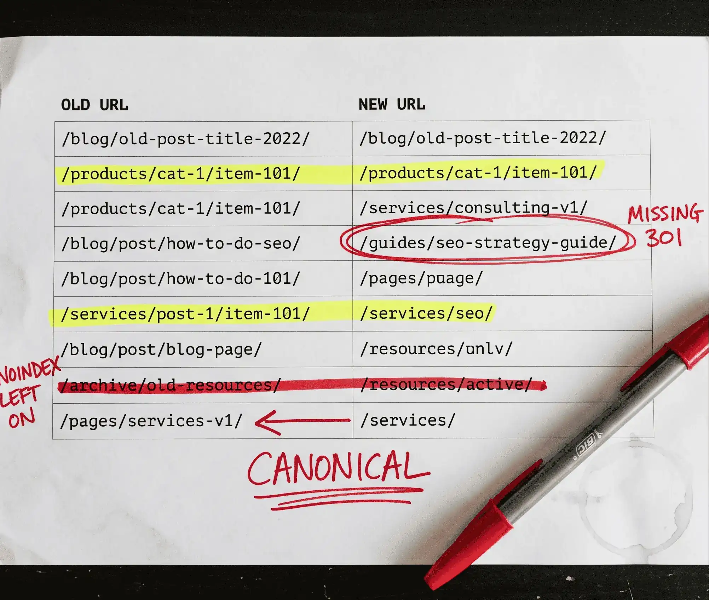

Most traffic drops after a website launch are not caused by the migration itself. They are caused by preventable errors made weeks before the site ever goes live. A clean **SEO migration** comes down to planning, redirects, and timing, not luck.

When those things go wrong, the result is a migration hangover: a prolonged, significant drop in organic traffic that can last 12 to 18 months. The difference between a normal post-launch dip and a real hangover is measurable, and the warning signs show up fast if you know what to watch for.

This guide treats SEO migration as two things at once: a technical event and an AI visibility event. In 2026, a botched migration can quietly remove your site from Perplexity, ChatGPT, and Google AI Overviews just as fast as it drops your traditional rankings. Most checklists ignore this. You get a phase-by-phase checklist, a way to tell a hangover apart from normal volatility, and a section on protecting AI search presence that other guides skip.

**Key Takeaways**

- Normal migration volatility is a 10% to 30% traffic dip that stabilizes within 2 to 6 weeks. A hangover is a drop of 50% or more with no recovery after 4 weeks.
- The top causes of a migration hangover are missing 301 redirects, noindex tags carried over to the live site, and canonical tags still pointing to old URLs.
- Bring your SEO team in at the design phase. Calling them in after launch to fix problems costs far more time.
- Your AI search visibility is at risk during a migration, the same way your organic rankings are. Most checklists do not address this at all.
- Pairing schema updates with an IndexNow ping after launch speeds up re-indexing.

## Quick Answers

**What is SEO migration?**
SEO migration is the process of protecting and transferring a website's search authority, rankings, and indexing signals when the site goes through major changes. Those changes include domain moves, CMS switches, URL restructuring, and full redesigns. The goal is to make those changes without losing organic traffic.

**How long does SEO migration recovery take?**
Recovery time depends on the type and scale of the migration. Smaller changes may recover in 1 to 3 months. A full domain change can take 6 to 12 months. A poorly prepared migration can take well over a year to fully recover, and good preparation shortens that significantly.

**What is a migration hangover?**
A migration hangover is a prolonged, significant drop in organic traffic after a website migration. Unlike normal volatility (a 10% to 30% temporary dip), a hangover is a drop of 50% or more that lasts beyond four weeks. It is usually caused by missing redirects, leftover noindex tags, or canonical tags still pointing to old URLs.

**Do I need a 301 redirect for every page?**
You need a 301 redirect for every page whose URL changes permanently. If a page is being removed with no equivalent on the new site, use a 410 status code instead of redirecting it to your homepage. Sending crawlers from an unrelated old URL to your homepage creates soft 404 signals and poor user experience.

**What happens if you skip SEO during a website migration?**
Skipping SEO during a migration risks your rankings, organic traffic, and conversions. Traffic drops of 40% to 50% are common in migrations handled without SEO input. Recovery is slow. Some sites take over a year to return to pre-migration levels. Some never fully recover.

**How does a website migration affect AI search visibility?**
A migration can cut your citations in ChatGPT, Perplexity, and Google AI Overviews if AI crawlers get blocked in robots.txt, schema markup is not carried over, or content quality drops during the redesign. AI crawler permissions and schema migration belong on every checklist in 2026.

## What Is SEO Migration?

SEO migration is the practice of preserving a website's search authority and traffic during major structural changes. Those changes include domain moves, platform switches, URL restructuring, and redesigns. The goal is to transfer the ranking signals your site has built so search engines keep sending traffic to the new version.

Here are the most common reasons to run an SEO migration:

- **Changing your domain name**, often as part of a rebrand
- **Moving to a new CMS**, for example from WordPress to Shopify or Webflow
- **Switching from HTTP to HTTPS** to secure the site
- **Restructuring site architecture** or URL patterns
- **Redesigning the site** with significant content or layout changes

Each type carries a different level of SEO risk. A domain change is the highest-risk migration you can run. An HTTP to HTTPS switch, done properly, is lower-risk but still needs careful redirect and canonical management. The table below maps the main types so you can set realistic expectations before you start.

| Migration Type | SEO Risk Level | Typical Recovery Time | Key Action Required |
|---|---|---|---|
| Domain change | High | 6 to 18 months | Full redirect map, GSC Change of Address |
| CMS replatform | High | 3 to 12 months | URL audit, schema migration, tag migration |
| Redesign with URL changes | Medium-High | 2 to 6 months | Redirect map, content preservation check |
| Redesign, no URL changes | Medium | 1 to 3 months | On-page element review, schema check |
| HTTP to HTTPS | Low-Medium | 1 to 2 months | Sitewide redirects, canonical updates |
| URL restructure only | Medium | 2 to 6 months | Full redirect map, internal link updates |

## Website Migration SEO: Normal Volatility vs. the Hangover

A website migration almost always causes a temporary drop in organic traffic. Google needs time to re-crawl, re-evaluate, and re-index changed content. That short dip is expected. What is not expected is a drop that compounds week over week with no sign of recovery. That is a migration hangover, and it calls for a different response.

Normal volatility looks like this:

- A dip of 10% to 30%
- Stabilizes and recovers within 2 to 6 weeks
- No new crawl errors in Google Search Console
- Indexed page count stays steady

A migration hangover looks like this:

- A drop of 30% to 50% or more
- No stabilization after 4 weeks or longer
- New crawl errors or 404s appearing in Search Console
- Indexed page count falling

The table below gives you a fast diagnosis when traffic moves after launch.

| Signal | Normal Volatility | Migration Hangover |
|---|---|---|
| Traffic drop | 10% to 30% | 50% or more |
| Recovery timeline | 2 to 6 weeks | Months to over a year |
| GSC crawl errors | None or minor | New errors appearing |
| Indexed page count | Stable | Falling |
| Ranking loss pattern | Temporary, minor | Broad, persistent |

A site that suffers a 30% drop post-migration can be fixed, but it is far better to avoid the situation in the first place. The rest of this guide shows you how.

## Phase 1: Pre-Migration SEO Checklist

Pre-migration is where most of the SEO work happens. The decisions you make before anything goes live determine if your migration becomes a growth event or a recovery project. For a standard site, plan for at least 4 to 8 weeks of pre-migration work. Enterprise-scale migrations need 3 to 6 months.

### 1. Set Goals and Capture Your Baseline

Define your success metrics before you touch anything. These might include a traffic retention target, a keyword preservation percentage, and target Core Web Vitals scores.

Then capture your baseline data 4 to 8 weeks out, not the day before launch:

- **Google Search Console:** rankings, indexed pages, Core Web Vitals, top queries
- **GA4:** organic sessions, conversion rates, top landing pages by revenue
- **Full crawl report:** every URL, status code, title tag, canonical tag, and schema type

Capture your AI visibility baseline too. Note how often your site shows up in AI Overviews, Perplexity results, and ChatGPT responses. You want a reference point for comparison after launch.

Set realistic targets. A poorly handled migration can take well over a year to fully recover, so do not promise stakeholders a two-week bounce-back.

### 2. Crawl and Document Everything

Crawl your live site with a dedicated crawl tool to get a full URL inventory before any changes are made. Export the following for every URL:

- Title tag and meta description
- H1
- Canonical tag
- Schema types
- Internal link count

Document your image URLs separately. Images have their own indexing equity and often get ignored entirely. Save everything in a structured spreadsheet with one tab per dataset. This crawl becomes your baseline for post-migration comparison and the foundation of your redirect map.

### 3. Build Your 301 Redirect Map

Map every current URL to its new destination before anything goes live. For pages being removed permanently with no equivalent, assign a 410 status code rather than redirecting to the homepage. Homepage redirects for unrelated removed pages create soft 404 signals and slow down crawling.

A few rules to follow:

- Prioritize redirects by traffic value. Your highest-traffic pages get verified first on launch day.
- Check for redirect chains before you implement. A redirect from A to B to C should become a direct A to C.
- Keep your map in a simple format your developers can work from.

A clean redirect map looks like this:

| Old URL | New URL | Status Code | Priority |
|---|---|---|---|
| /old-page/ | /new-page/ | 301 | High |
| /retired-post/ | (none) | 410 | Medium |

### 4. Protect High-Value Pages and Backlink Assets

Find your high-value pages using Google Search Console (top by clicks and impressions) and GA4 (top by revenue and conversions). Then pull your backlink profile. Pages with the most authoritative inbound links need specific attention in your redirect map.

Flag these pages for manual redirect verification on launch day. Any page with significant backlink equity that loses its redirect loses that authority, and getting it back is slow.

### 5. Set Up and Lock Down Your Staging Site

Add noindex and password protection to the staging site right away. Both, not one. This keeps the test site out of search results before it is ready.

Then work through the rest:

- Give Googlebot temporary access later, closer to launch, to confirm the site crawls correctly
- Lower your DNS TTL value 48 to 72 hours before launch if you are switching hosts
- Run a full <a href="/blog/technical-seo-site-audit/" target="_blank" rel="noopener">technical SEO audit</a> on staging and fix errors before you migrate them to the live site
- Confirm the staging audit passes before you set a final launch date

### 6. Protect Your Schema and AI Visibility

This step is the one most guides skip, and it matters more every quarter.

Start by documenting every schema type on your current site: FAQPage, HowTo, Article, LocalBusiness, and any others. Confirm each one carries over correctly to the new CMS. Schema gets lost during replatforms more often than you would expect.

Next, check that your robots.txt allows AI search crawlers. These should all be allowed:

- OAI-SearchBot
- ChatGPT-User
- PerplexityBot
- Bingbot
- Googlebot

If you want to block training crawlers separately from search crawlers, disallow GPTBot and Google-Extended. If your site publishes structured technical or reference content, consider adding an llms.txt file that AI agents can use to find your key pages directly. Finally, plan an IndexNow ping for the moment your schema goes live on the new site.

## Phase 2: Launch Day SEO Checklist

Launch day is not the time for new decisions. It is time to execute what you planned and confirm it worked. Keep at least one developer on standby for the first 24 to 48 hours. Launch during low-traffic hours on a Tuesday, Wednesday, or Thursday. Avoid Fridays, so you are not troubleshooting over a weekend.

Work through this checklist in order:

1. **Remove all noindex and nofollow tags** from the live site immediately after launch. This is the single most common cause of a catastrophic post-launch drop.
2. **Remove staging site password protection** so users and crawlers can reach the new site.
3. **Verify your 301 redirects are live.** Manually check your top 10 highest-traffic pages.
4. **Submit your updated XML sitemaps** in Google Search Console.
5. **Use the GSC Change of Address tool** if you changed your domain.
6. **Confirm robots.txt is correct.** It should allow crawlers, reference the new sitemap, and disallow /staging/, /wp-admin/, and any parameter URLs.
7. **Check that analytics and tag manager are firing** on the live site.
8. **Test checkout, forms, and every conversion point.** Complete a real transaction if you run ecommerce.
9. **Ping IndexNow** after your schema updates go live.

## Phase 3: Post-Migration Monitoring (First 90 Days)

The migration is not done when the site goes live. The first 90 days are when hangovers develop. Monitor weekly in the first month, then move to every two weeks. The earlier you spot a problem, the faster you can fix it before it compounds into a long-term ranking loss.

### What to Check in the First 2 Weeks

- Re-run your full site crawl and compare it against your pre-migration baseline
- Check Google Search Console for new crawl errors and 404s daily for the first week
- Watch your indexed page count. It should hold steady or grow. A falling count is a warning sign.
- Confirm analytics is capturing data correctly
- If organic traffic drops more than 30%, investigate right away. Do not wait for the 30-day checkpoint.

### What to Check at 30, 60, and 90 Days

Set these calendar reminders before launch, not after.

| Checkpoint | What to Review |
|---|---|
| 30 days | Full technical audit, keyword ranking comparison (pre vs. post), backlink outreach for updated URLs, redirect chain audit |
| 60 days | Conversion rate comparison, Core Web Vitals vs. baseline, page speed across devices |
| 90 days | Full organic traffic comparison, AI visibility comparison, schema performance review |

### Track AI Visibility Post-Migration

Use AI visibility tools to check if your site still shows up in AI Overviews, Perplexity results, and ChatGPT responses after the migration. This matters because a migration can accidentally block AI crawlers or strip the schema that AI systems relied on for citations.

If your AI visibility drops, check three things in order:

- Your robots.txt, for accidentally blocked AI crawlers
- Your schema migration, for missing or broken markup
- Your content, for quality or relevance changes on key pages

### Resolve Redirect Chains

A redirect chain happens when URL A redirects to URL B, which redirects to URL C. Each hop adds load time and forces crawlers to spend budget on URLs that hold no content.

To fix them, point A directly to C. Run a crawl of the new site, filter for redirect chains, and update the source URLs. This is not urgent, but it is worth clearing within the first 90 days.

## What Causes a Migration Hangover?

A migration hangover is caused by preventable technical errors, not by the migration itself. Most cases share a small set of root causes. Knowing them helps you check for each one during staging and the first days after launch.

1. **Missing or broken 301 redirects.** Even one missed high-authority URL can cause a significant traffic dip. Redirects pass link equity to your new URLs. Without them, Google treats the old page as gone and strips its ranking power.

2. **Noindex tags left on the live site.** Developers set noindex on staging to prevent premature indexing, then forget to remove it. Once Google starts de-indexing the site, recovery takes days to weeks.

3. **Canonical tags pointing to old URLs.** New pages will not rank because Google keeps crediting the old URL as the true authority. This is one of the most common hangover causes and one of the hardest to catch with a basic crawl.

4. **Content changes that hurt relevance.** Rewriting copy or restructuring headings during a redesign changes keyword relevance. Rankings follow content signals, not just URL signals.

5. **Page speed regression.** A new design or new CMS can quietly make the site slower. Core Web Vitals are a ranking signal, so a performance drop after migration chips away at rankings over time.

6. **Unnecessary URL changes.** Even correct 301 redirects are not a perfect authority transfer. URL changes at scale force Google to reassess page signals. Keep your URL patterns where you can.

## Common SEO Migration Mistakes to Avoid

Most migration mistakes are predictable. The teams that avoid them are the ones who know what to watch for before the first line of code changes. Here are the errors that cause the most damage:

- **Bringing SEO in after the site is built.** By then the URL structure is set, the content is written, and redesigning for SEO is expensive.
- **No rollback plan.** If something goes wrong, you need a tested path back to the old site.
- **Redirecting deleted pages to the homepage** instead of serving a 410 status code.
- **Updating internal links after launch** instead of on staging. Internal redirects waste crawl budget and slow the site.
- **Forgetting image SEO.** Images are indexed separately and can drive meaningful traffic. Check Search Console for image search performance before you migrate.
- **Skipping AI crawler permissions.** A robots.txt that blocks PerplexityBot or OAI-SearchBot after migration is a silent traffic leak you may not catch for months.

## A Clean Migration Is a Growth Event

A well-planned SEO migration is a growth event. A poorly planned one can cost a year of rankings. The difference comes down to preparation, early SEO involvement, and close monitoring through the first 90 days.

Add AI visibility to your checklist while you are at it. It takes ten minutes to update robots.txt and confirm your schema carried over. It takes months to recover from a hangover caused by skipping that step.

If you have a site migration on the horizon, book a free audit through my <a href="/services/seo-specialist/" target="_blank" rel="noopener">SEO specialist service</a> and I will help you protect your traffic and rankings before launch.

## Frequently Asked Questions

### How long does it take to recover SEO rankings after a migration?

Recovery time varies by migration type and how well you prepared. Smaller changes like minor URL updates may stabilize within 1 to 3 months. A full domain change can take 6 to 12 months. A poorly prepared migration can take well over a year to fully recover, and the worst hangovers happen when SEO is not involved until after launch. Well-prepared migrations recover faster.

### What is the difference between a 301 and a 302 redirect in a migration?

A 301 redirect is permanent. It tells Google the page has moved for good and transfers ranking authority to the new URL. A 302 redirect is temporary and does not reliably pass authority. During a migration, you almost always need 301 redirects. Use a 302 only if a URL change is genuinely temporary, such as a time-limited promotion or a page under active testing.

### Can a migration hurt rankings even when done correctly?

Yes. A temporary dip of 10% to 30% is normal even in a clean migration. Google needs time to re-crawl and re-evaluate changed content. The goal is not to prevent all fluctuation. It is to prevent a prolonged hangover, meaning a drop of 50% or more that does not recover within four weeks. Normal volatility settles on its own. A hangover needs active diagnosis and repair.

### How does a website migration affect AI search visibility?

AI answer engines rely on crawlable, structured content. A migration that blocks AI crawlers in robots.txt, strips FAQPage or HowTo schema, or degrades content quality can cut your AI citations significantly. Add AI crawler permissions, schema migration checks, and an IndexNow ping to your checklist. Review your AI visibility at the 30-day mark alongside your organic traffic.

### Should SEO be involved from the start of a migration project?

Yes. Sites that involve SEO from the initial design and wireframing phase have much better outcomes than those that bring SEO in after development is finished. At a minimum, SEO should review the information architecture, URL structure, content plan, and redirect strategy before any code is written. Fixing a live site costs more time than doing it right the first time.
