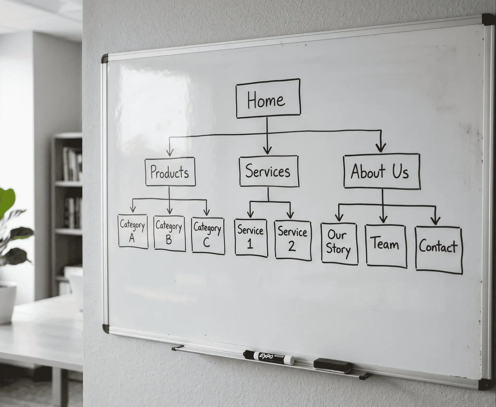
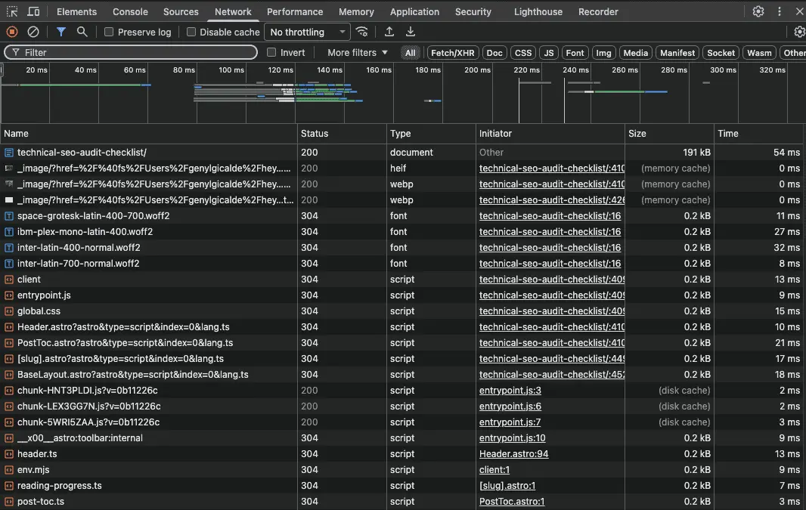
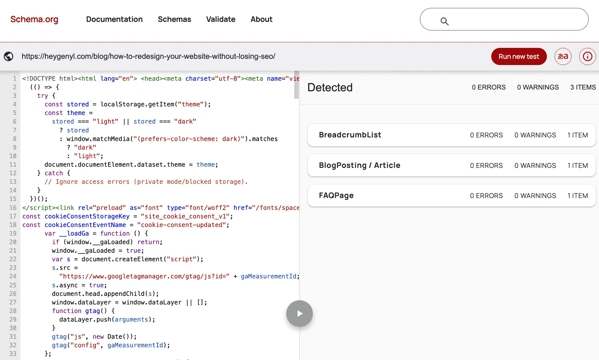
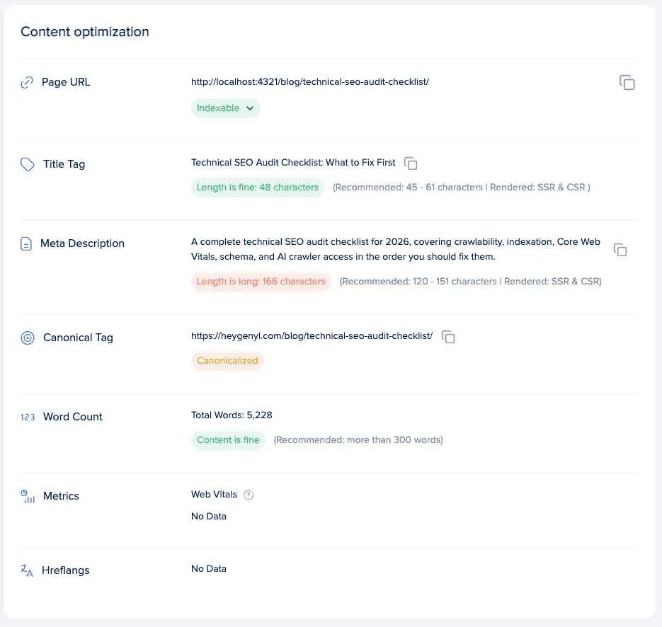

Most websites have more technical SEO problems than their owners realize. Broken redirects go unfixed for months. Schema markup gets implemented once and never validated again. robots.txt files from three years ago still treat AI crawlers as an afterthought.

A technical SEO audit is how you find and fix those problems before they cost you rankings or AI visibility.

This technical SEO audit checklist covers every area that matters: crawlability, indexation, JavaScript rendering, site architecture, Core Web Vitals, schema markup, mobile performance, security, content-level issues, images, and video. It also covers the 2026-specific requirements most audits still miss, including deliberate AI crawler decisions and machine-readable entity schema.

Use it as a complete pre-migration review or as a recurring quarterly reference. Each section opens with a direct answer you can act on immediately.

**Key Takeaways**

- Crawlability and indexation come first. If Googlebot cannot reach your pages, nothing else in the audit matters.
- Your robots.txt needs an intentional AI crawler strategy in 2026. Training bots and retrieval bots have different user-agent strings and different business implications.
- Schema markup is infrastructure, not polish. Article, Person, Organization, and FAQPage schema directly affect AI citation rates and entity recognition.
- Core Web Vitals have updated metrics. INP replaced FID in March 2024, and many sites are still auditing against the retired metric.
- Technical audits have a clear priority sequence. Fix crawlability first, then schema and Core Web Vitals, then content issues and image optimization.

## Quick Answers

**What is a technical SEO audit checklist?**
A technical SEO audit checklist is a structured list of checks that confirms search engines can crawl, render, and index your site correctly. It covers robots.txt, XML sitemaps, site speed, schema markup, mobile performance, security, and content-level issues. In 2026, a complete checklist also covers AI crawler access and entity schema.

**What should I check first in a technical SEO audit?**
Start with crawlability and indexation. Run a `site:yourdomain.com` query to verify your pages appear in Google's index. Then check your robots.txt for accidental blocks, review Google Search Console's Pages report for crawl errors, and confirm your XML sitemap contains only canonical, indexable URLs. Fix any indexation issues before addressing anything else.

**How often should you run a technical SEO audit?**
Run a full technical SEO audit at least once per quarter, and a focused crawl audit monthly on large or actively developed sites. Any major site migration, redesign, or CMS change warrants an immediate audit. For a closer look at timing, see <a href="/blog/how-often-should-you-conduct-an-seo-audit/" target="_blank" rel="noopener">how often you should conduct an SEO audit</a>. Set up continuous monitoring in Google Search Console to catch critical issues like lost indexation or sudden crawl errors between scheduled audits.

**What tools do you need for a technical SEO audit?**
The core tools are Google Search Console (free), a site crawler like Screaming Frog or Sitebulb, PageSpeed Insights for Core Web Vitals, and Google's Rich Results Test for schema validation. For larger sites, a log file analyzer helps identify actual crawler activity. Most paid SEO platforms combine several of these into a single workflow.

**Does technical SEO affect AI search visibility?**
Yes. AI answer engines like Google's AI Overviews, Perplexity, and ChatGPT Search prefer pages with complete schema markup, verified authorship, and content that loads fully in raw HTML before JavaScript executes. A site that AI crawlers cannot render, attribute, or interpret clearly is far less likely to be cited in AI-generated answers, regardless of content quality.

**What is the difference between a technical SEO audit and an on-page SEO audit?**
A technical SEO audit focuses on infrastructure: how well search engines access, render, and understand your site at a server and code level. An on-page SEO audit focuses on individual page content, keyword optimization, and structure. Both are needed for strong rankings, but technical issues must be resolved first. Broken infrastructure limits how far on-page optimization can take you.

## What Is a Technical SEO Audit?

A <a href="/blog/technical-seo-site-audit/" target="_blank" rel="noopener">technical SEO audit</a> is a systematic review of the factors that affect how search engines crawl, render, and index your website. It covers site architecture, crawlability, page speed, schema markup, mobile performance, and security. A complete audit identifies the technical barriers preventing your pages from ranking or appearing in AI-generated answers.

Technical SEO is the infrastructure layer of search optimization. It sits below on-page SEO (keyword targeting, content quality) and off-page SEO (backlinks). If the infrastructure is broken, neither of those can compensate.

A full audit covers:

- **Crawlability and indexation:** Can search engines reach and save your pages?
- **Rendering:** Can they see your content after JavaScript executes?
- **Site architecture:** Are your pages connected logically and efficiently?
- **Core Web Vitals:** Does the site load fast enough to meet Google's ranking thresholds?
- **Schema markup:** Can machines understand what your content is and who created it?
- **Mobile performance:** Is the mobile version of your site fully equivalent to desktop?
- **Security:** Is your site properly encrypted and free from injected content?
- **Content-level issues:** Are duplicate pages, orphaned URLs, or thin content diluting your crawl efficiency?
- **Images and video:** Are media assets optimized for search and discoverability?

In 2026, a complete audit also requires deliberate decisions about AI crawlers, entity schema, and FAQPage schema's changed role. Each of those is covered in full below.

## How to Audit Crawlability and Indexation

Crawlability and indexation are the foundation of any technical audit. If search engines cannot reach and save your pages, no other optimization matters. Start by pulling your robots.txt, running a `site:domain.com` search to check indexation, and reviewing your Google Search Console Pages report for crawl errors.

### robots.txt

Your robots.txt file tells crawlers which parts of your site to access and which to avoid. Most files have not been meaningfully updated in years. That creates two problems: accidental blocks on important pages, and no deliberate decisions about AI crawlers.

Pull your file at `yourdomain.com/robots.txt` and check the following:

- Googlebot and Bingbot have full access to your important pages
- Low-value URLs are blocked: faceted navigation, internal search results, parameter URLs, staging paths
- Your XML sitemap URL is referenced at the bottom of the file

Then address AI crawlers. There are two distinct categories.

**Retrieval bots** power live AI answers and can send referral traffic to your site. Allowing these is generally in your interest:

- `OAI-SearchBot`: powers ChatGPT search results
- `ChatGPT-User`: user-triggered browsing in ChatGPT
- `PerplexityBot`: powers Perplexity answers
- `Bingbot`: powers Bing AI and Copilot answers

**Training bots** consume your content to train AI models but send no traffic back. Blocking these is a legitimate strategic choice, not a technical error:

- `GPTBot`: OpenAI's training crawler
- `Google-Extended`: Google's opt-out for Gemini and Vertex AI training

AI crawler user-agent strings change as platforms update. Verify the current list against each company's official documentation before updating your file, and review it quarterly.

For sites that publish structured technical or reference content, consider adding an `llms.txt` file. AI agents can use it to access your most valuable content directly, without crawling the entire site.

### XML Sitemap

Your XML sitemap tells search engines which pages exist and when they were last updated. A poorly maintained sitemap actively misleads crawlers.

Check that your sitemap:

- Contains only indexable, canonical URLs (no 404s, redirects, or noindexed pages)
- Is segmented by content type on large sites (articles, products, categories)
- Auto-updates when new content is published
- Is submitted to both Google Search Console and Bing Webmaster Tools
- Is referenced in your robots.txt file

If your sitemap URL count and your Search Console indexed page count are far apart, investigate which direction the gap runs. More sitemap URLs than indexed pages points to indexation problems. More indexed pages than sitemap URLs means pages are being crawled outside your sitemap.

### Crawl Budget and Log File Analysis

Crawl budget used to be an enterprise concern. It is increasingly relevant on mid-sized sites now that AI bots run alongside Googlebot, Bingbot, and dozens of lesser-known scrapers, all hitting your server in parallel.

Run a log file analysis on any site over roughly 500 pages. Look at which bots are crawling which pages, how frequently, and in what volume. The most common finding: a significant portion of crawl activity is going to paginated archives, duplicate filtered views, and staging paths that were never cleaned up.

Every crawl cycle spent on those pages is a cycle not spent on content that matters.

### Indexation Verification

Before spending time on anything else, confirm your important pages are actually indexed.

- Run `site:yourdomain.com` in Google and compare the result count to your actual page count
- In Google Search Console, open the Pages report and look for "Discovered but not indexed" and "Crawled but not indexed"
- Use the URL Inspection tool on your highest-priority pages to verify Google's selected canonical matches your intended one
- A large discrepancy between expected and actual indexed pages is the first problem to resolve

## Does JavaScript Affect How Your Site Gets Indexed?

Yes. Google renders JavaScript in two waves, which can delay indexing by days or weeks. AI retrieval bots often skip JavaScript rendering entirely. If your headings, body copy, or internal links depend on client-side JavaScript to load, parts of your site may be invisible to the systems you most want reading it.

Google's two-wave rendering works like this: the first wave crawls the raw HTML, and JavaScript rendering happens later, sometimes hours and sometimes weeks after the initial crawl. Content that only appears after JavaScript executes may not be indexed promptly and, in some cases, may not be indexed at all.

AI retrieval bots are generally less capable than Googlebot when it comes to JavaScript rendering. If your content requires client-side JavaScript to appear, treat it as effectively invisible to those systems.

To check for rendering issues:

- Open Google's URL Inspection tool in Search Console and select "View Rendered Page" to compare the rendered DOM against the raw HTML source
- Use Google's Rich Results Test as a secondary check on key pages
- For each check, confirm that headings, body copy, and internal links are present in the raw source before JavaScript runs
- If key content is missing from the raw HTML, that is a rendering problem requiring action

Server-side rendering (SSR) or static site generation is the clearest path to broad crawler compatibility. Both approaches make your content accessible to the widest range of bots, AI and otherwise.

## How Does Site Architecture Affect SEO?

Site architecture controls how easily crawlers and users move through your content. Pages buried more than three clicks from your homepage receive less crawl priority. Shallow, logical hierarchies with descriptive internal link anchor text help search engines understand topical relationships and distribute authority across your most important pages.

Site architecture is one of the clearest signals you have for establishing topical authority, and improving it costs nothing but time.

Run a site crawl and audit the following:

- **Crawl depth:** Every important page should be reachable within three clicks from your homepage. Pages deeper than that receive progressively less crawl attention.
- **Internal link distribution:** Look at which pages receive the most internal links. Your most important pages should be near the top of that list. If they are not, the architecture needs restructuring.
- **Orphan pages:** Pages with no incoming internal links are invisible to crawlers regardless of content quality. Identify them by comparing sitemap URLs against crawled URLs in your site crawler.
- **Anchor text:** Every internal link should use descriptive anchor text. "Click here" and "read more" communicate nothing about the linked page's topic. Use specific, relevant phrases.
- **Content clusters:** Group related content into logical hierarchies with a pillar page linking to supporting posts. This helps AI systems understand the conceptual relationships between your pages, which influences both topical authority signals and citation behavior.
- **Redirect chains in internal links:** Any internal link pointing to a URL that then redirects loses equity at each hop. Fix these by updating the link to point directly to the final destination URL.

Tools: Screaming Frog or Sitebulb for crawl-based analysis, and the Internal Links report in Google Search Console.

## How to Check Core Web Vitals: LCP, INP, and CLS

Core Web Vitals are three performance metrics Google uses as a ranking signal. LCP should load in under 2.5 seconds. INP, which replaced FID in March 2024, should respond in under 200 milliseconds. CLS should stay below 0.1. Failing any one of these limits how well your pages compete, especially on mobile.

| Metric | What It Measures | Target | Common Causes of Failure |
| --- | --- | --- | --- |
| **LCP** (Largest Contentful Paint) | How quickly the largest visible element loads | Under 2.5 seconds | Large unoptimized hero images, render-blocking resources, slow server response |
| **INP** (Interaction to Next Paint) | How quickly the page responds visually after a user interaction | Under 200 milliseconds | Heavy JavaScript execution, third-party scripts, large event handlers |
| **CLS** (Cumulative Layout Shift) | Visual stability as the page loads | Under 0.1 | Images without defined dimensions, late-loading ads, web fonts swapping after load |

A few points on how to measure accurately:

- Use PageSpeed Insights and the Chrome User Experience Report (CrUX) for field data. Lab scores (simulated environments) and field scores (real user data) often differ, and Google uses field data for ranking.
- Run separate audits for desktop and mobile. The Core Web Vitals ranking signal applies primarily to mobile results.
- If your audit tool is still reporting FID, update it. INP replaced FID in March 2024 and is what Google now measures.

Common quick wins by metric:

- **LCP:** Compress and properly size images, serve images in WebP or AVIF format, and remove render-blocking resources above the fold
- **INP:** Audit third-party JavaScript load, reduce main-thread blocking time, and defer non-essential scripts
- **CLS:** Define width and height attributes on all images, reserve space for ads and embeds before load, and preload key web fonts

## How to Audit Schema Markup in 2026

Schema markup is structured data that tells search engines and AI systems explicitly what your content is, who created it, and how trustworthy it is. In 2026, schema is no longer optional polish applied after everything else is clean. It is infrastructure. An audit that skips schema leaves your site invisible to AI citation.

Most sites that implemented schema years ago have never validated it against updated Google requirements. Others have partial coverage, leaving high-value pages without machine-readable authorship or entity signals. Both are audit priorities.

Work through each schema type in the order below.

### Article, BlogPosting, and Person Schema

Every content page on your site should carry `Article` or `BlogPosting` markup. At minimum, include:

- `headline`: the title of the page
- `author`: a `Person` entity (not a plain text string)
- `datePublished`: original publication date
- `dateModified`: last updated date
- `publisher`: a linked `Organization` entity

The author field matters more than most sites treat it. A plain text name string does nothing to build entity associations. A `Person` entity with `name`, `url`, and `sameAs` links to authoritative profiles (LinkedIn, published work, professional directories) creates machine-readable credibility.

`dateModified` is an active AI recency signal. AI systems weight content freshness when selecting sources to cite, so a page with a recent `dateModified` in its structured data is a more citable object than one with no date signal. Update this field every time you revise the article.

### Organization Schema and Entity Building

Your homepage or About page should include `Organization` markup with:

- `name`
- `url`
- `logo`
- `contactPoint`
- `sameAs` links to verified social profiles and authoritative external references (LinkedIn, Crunchbase if applicable, Wikipedia if applicable, relevant industry directories)

Organization schema builds entity recognition. AI systems use `sameAs` to connect your website, your LinkedIn page, your news mentions, and your Google Business Profile as one coherent entity. Without it, your site is a collection of disconnected signals rather than a recognized brand. That distinction directly affects AI citation decisions.

Entity recognition is how AI systems decide whether a source is trustworthy enough to cite. This is not about aesthetics. It is about machine-readable credibility.

### FAQPage Schema After the 2025 Demotion

Google restricted FAQPage rich results in SERPs to government and health sites in late 2025. For most sites, FAQPage schema no longer generates a visual rich result in search.

That does not mean you should remove it.

The Q&A format maps closely to how AI systems construct responses: a question followed by a direct, complete answer. Structured Q&A content remains among the most frequently cited formats in AI-generated answers. Keep existing FAQPage markup on pages that already have it, and apply it to new Q&A sections specifically for AI citation purposes, not for SERP rich results.

### HowTo, BreadcrumbList, and Product Schema

- **HowTo:** Apply to any step-by-step tutorial or instructional content. Step-by-step content is heavily cited in AI Overviews. Marking the structure explicitly makes it citable; leaving it implicit does not.
- **BreadcrumbList:** Low effort, high signal value. It clarifies your site hierarchy to crawlers and reinforces your internal architecture. If you do not have it, add it.
- **Product (where applicable):** AI shopping agents pull directly from structured product data. Incomplete markup means incomplete representation in AI-generated product comparisons and recommendations.
- **VideoObject:** Required for video search eligibility. Covered in the Images and Video section below.

### Schema Validation

Once you have audited your schema coverage, validate everything.

- Use Google's Rich Results Test on a representative sample of each page type on your site
- Check the Enhancements report in Google Search Console for markup errors and warnings
- Fix errors before adding new schema types. Invalid markup can actively suppress rich results and confuse AI retrieval systems.

After any schema update or article refresh, send an IndexNow ping. Schema tells AI systems what changed; IndexNow tells them that something changed. Together, they improve indexing speed and accuracy.

## Mobile, Security, and On-Page Technical Checks

Google indexes the mobile version of your site by default. If your mobile content, meta tags, or structured data differ from the desktop version, you risk losing indexed content. Security and on-page technical signals like canonical tags, title tags, and meta descriptions round out the essentials of a complete technical audit.

### Mobile-First Indexing

Google has used mobile-first indexing as the default since 2021. The mobile version of your site is what Google crawls and indexes. Desktop is secondary.

Check that your mobile and desktop versions match on:

- Page content (no truncated or hidden content on mobile)
- Heading tags
- Structured data
- Meta robots tags
- Title tags and meta descriptions
- Internal links
- Images and alt text

Responsive design serves the same URL and the same content to all devices, with layout adjusted by CSS. It is strongly preferred over separate m.site configurations or dynamic serving. The latter two require additional signals to avoid indexation problems and are harder to maintain correctly.

Use Google Search Console's Mobile Usability report and the URL Inspection tool (View Rendered Page on mobile) to identify specific failures.

### HTTPS and Security

HTTPS is an official Google ranking signal. It is a minor one, but non-HTTPS sites trigger "Not Secure" warnings in modern browsers, which harms user trust and click-through rates regardless of rankings.

- Confirm all pages serve over HTTPS
- Check for mixed content warnings: HTTP resources loading on an HTTPS page
- Consider HSTS (HTTP Strict Transport Security), which instructs browsers to always load your site over HTTPS automatically; Google recommends it for improved security, though it is not a direct ranking signal

Check for hacked content and malware via Google Search Console's Security Issues report and Google's Safe Browsing tool. If Search Console is not set up, open your site in an incognito Chrome window and look for browser security warnings.

### Title Tags, Meta Descriptions, and Canonical Tags

These three elements have the best audit-to-return ratio for the effort they require.

**Title tags:**

- Every page needs a unique title
- Keep important keywords in the first 60 characters, where they remain visible in SERP snippets and directly affect CTR
- Avoid boilerplate patterns that repeat identical phrasing across large sections of the site

**Meta descriptions:**

- Google ignores them and generates its own much of the time
- Duplicate descriptions make Google even less likely to use them
- Write them anyway. When Google does use them, a clear description improves CTR.

**Canonical tags:**

- Every page needs a self-referencing canonical
- In Google Search Console's Coverage report, verify that Google's selected canonical matches your intended canonical
- Common mismatches: HTTP vs. HTTPS, www vs. non-www, and trailing slash variants
- A canonical mismatch silently funnels authority to the wrong URL

## Content-Level Technical Issues

Duplicate content, thin pages, and orphaned URLs are common technical issues found in content audits. Google filters duplicate pages from search results and deprioritizes thin content. Orphan pages get skipped by crawlers because no internal links point to them. Fixing these issues improves crawl efficiency and helps Google index your best content correctly.

### Duplicate Content and Canonicalization

Google does not penalize <a href="/blog/why-duplicate-content-is-an-seo-issue/" target="_blank" rel="noopener">duplicate content</a>, but it does filter it. Only one version of a duplicate page appears in search results. The others are excluded from ranking.

Common sources of duplicate content:

- HTTP and HTTPS versions both accessible
- www and non-www both accessible
- Trailing slash and no-trailing-slash variants
- URL parameters that do not change page content (session IDs, tracking parameters, sort parameters)
- Faceted navigation creating near-infinite URL variations

Fix with canonical tags pointing to the primary version, 301 redirects for URL variants, and noindex tags for near-duplicate pages that should not rank. Run a site crawl to identify all affected URLs, then use Google Search Console's Coverage report to confirm Google's selected canonical is the one you intended.

### Thin Content

Thin content describes pages that offer little value to users: auto-generated pages, content copied from other sources, ad-heavy pages where content is secondary, or sparse pages with minimal substance.

Google's Helpful Content system evaluates this at the sitewide level. A high proportion of thin pages does not just hurt those pages individually. It can suppress the entire domain.

Actions:

- Rewrite thin pages with genuine depth and useful information
- Consolidate thin pages that cover similar topics by 301 redirecting the weaker page to the stronger one
- Remove and redirect pages with no viable path to improvement
- Do not attempt to fix thin content by padding with keyword-dense filler. Google can detect it.

### Orphan Pages

Orphan pages have no incoming internal links. Crawlers reach pages by following links from other pages, so a page with no links pointing to it is invisible to crawlers regardless of content quality.

Identify orphan pages by comparing your sitemap URLs against the URLs your site crawler discovered through internal link following. Pages in the sitemap but absent from the crawl output are orphans.

Fix this by adding contextually relevant internal links from existing content on related topics. For orphan pages with thin content, consider consolidating them into a stronger related piece instead of linking to them.

## Images and Video

Images and video can drive meaningful organic traffic when optimized correctly. Every image needs a descriptive alt attribute, defined dimensions, and a human-readable filename. Videos hosted on your own pages need video schema markup and a video sitemap to be eligible for video search results. Both areas are frequently skipped in standard audits.

### Images

Check each of the following:

- **Alt attributes:** Write descriptive, concise alt text that would make sense to someone using a screen reader. Avoid keyword stuffing. An image of an oil change on a diesel engine should read something like "mechanic draining oil from a diesel engine," not "diesel engine oil change diesel maintenance service repair."
- **Defined dimensions:** Every image should have explicit `width` and `height` attributes in the HTML. Missing dimensions cause Cumulative Layout Shift (CLS) and hurt your Core Web Vitals score.
- **Filenames:** Use human-readable, descriptive filenames. `diesel-engine-oil-change.jpg` is indexable. `IMG_004782.jpg` is not.
- **Image sitemaps:** List images in a sitemap for better discoverability and indexation, particularly for images served via a CDN.
- **Compression and format:** Use WebP or AVIF. Large unoptimized images are the most common cause of LCP failures.
- **Google Discover eligibility:** Add the `max-image-preview:large` setting in your robots meta tag. Google recommends images of at least 1,200 pixels wide for Discover inclusion.

### Video

- Every video that should rank must appear on a public, indexable page. Google ranks the page hosting the video, not the video file itself.
- Wrap video in appropriate HTML tags: `<video>`, `<embed>`, `<iframe>`, or `<object>`
- Apply `VideoObject` schema with the required fields: `name`, `description`, `thumbnailUrl`, and `uploadDate`
- Add a video sitemap for better discoverability (not required if VideoObject schema is present, but best practice to use both)
- Use `Clip` or `SeekToAction` schema to define key moments (timestamps) for appearance in video search results

## How to Prioritize Your Technical SEO Audit Fixes

Not every technical SEO issue deserves equal urgency. Crawlability and indexation errors should be fixed first because they block all other ranking signals. Schema markup and Core Web Vitals come next because they directly affect click-through rates and AI citation. Image and video optimizations offer meaningful gains with lower implementation complexity.

Use this matrix to sequence your work:

| Priority | Audit Area | Effort | Impact |
| --- | --- | --- | --- |
| Fix immediately | Crawlability and indexation errors | Low-medium | Blocking: nothing ranks without this |
| Fix immediately | robots.txt AI crawler decisions | Low | AI visibility; low-effort update |
| Next sprint | Core Web Vitals (LCP, INP) | Medium-high | Rankings and user engagement |
| Next sprint | Schema markup: Article, Person, Organization | Medium | AI citation and rich results eligibility |
| Scheduled | Schema validation and cleanup | Low | Prevents active suppression |
| Scheduled | Duplicate content and canonicalization | Medium | Crawl efficiency and index clarity |
| Scheduled | Orphan pages and internal link cleanup | Low-medium | Crawl reach and authority distribution |
| Ongoing | Image optimization | Low-medium | LCP improvement and image search |
| Ongoing | Video schema and sitemaps | Low-medium | Video search eligibility |
| Immediate if triggered | Security: HTTPS errors, hacked content | Varies | User trust and rankings |

A few additional notes:

- Run a log file analysis before setting priorities on any site over roughly 500 pages. The results may reveal crawl budget waste that changes your sequencing.
- Schedule quarterly audits as a standing calendar event. Set the reminder at the start of each quarter.
- After any schema update or content refresh, send an IndexNow ping. Schema tells AI systems what changed; IndexNow tells them that something changed. Together, they accelerate accurate re-indexing.

## The Audit Is Never Really Finished

A technical SEO audit is not a one-time project. Google updates its requirements, AI search shifts what "technically ready" means, and your site changes faster than most audits account for.

Work through this checklist in order. Start with crawlability and schema, then address Core Web Vitals and content issues. Treat the audit as a quarterly process, not a task you complete once.

If you want a second set of eyes on your site, book a free audit through my <a href="/services/seo-specialist/" target="_blank" rel="noopener">SEO specialist service</a> and I will help you find the issues that are actually worth fixing first.

## Frequently Asked Questions

### Should I block AI crawlers like GPTBot in my robots.txt?

It depends on your goals. GPTBot trains OpenAI models but sends no referral traffic, so blocking it prevents your content from being used in training. OAI-SearchBot and PerplexityBot are retrieval bots that power live AI answers and can send referral traffic. Blocking training bots while allowing retrieval bots is a legitimate strategic call, not paranoia.

### Is FAQPage schema still worth using after the 2025 Google update?

FAQPage schema no longer produces rich results in SERPs for most sites, following Google's demotion in late 2025. But it remains valuable for AI search. The structured question-and-answer format maps directly to how AI systems assemble responses. Keep existing FAQPage markup and apply it to new Q&A sections specifically for AI citation purposes, not SERP results.

### What is the most common technical SEO issue found in audits?

Broken internal links and duplicate content top most audit reports. Missing or incorrect canonical tags are a close second. On larger sites, orphan pages (pages with no internal links pointing to them) are widespread. Schema markup errors appear frequently on sites that implemented structured data years ago and never validated it against updated Google requirements.

### Can I run a technical SEO audit without paid tools?

Yes. Google Search Console is free and covers indexation, crawl errors, Core Web Vitals, mobile usability, and schema validation. PageSpeed Insights is free for performance data. Screaming Frog's free tier crawls up to 500 URLs. Google's Rich Results Test validates schema markup. Paid tools add scale, automation, and bulk reporting, but they are not required for smaller sites.

### How do I know if my technical SEO fixes are working?

Check Google Search Console's Pages report for improvements in indexed page counts. Monitor Core Web Vitals scores over four to six weeks after speed fixes. Use the URL Inspection tool to confirm new schema is recognized. Watch your crawl stats in Search Console for increased frequency. Organic impressions and click data in GSC typically take four to eight weeks to reflect technical improvements, though timelines vary by site size and issue severity.
